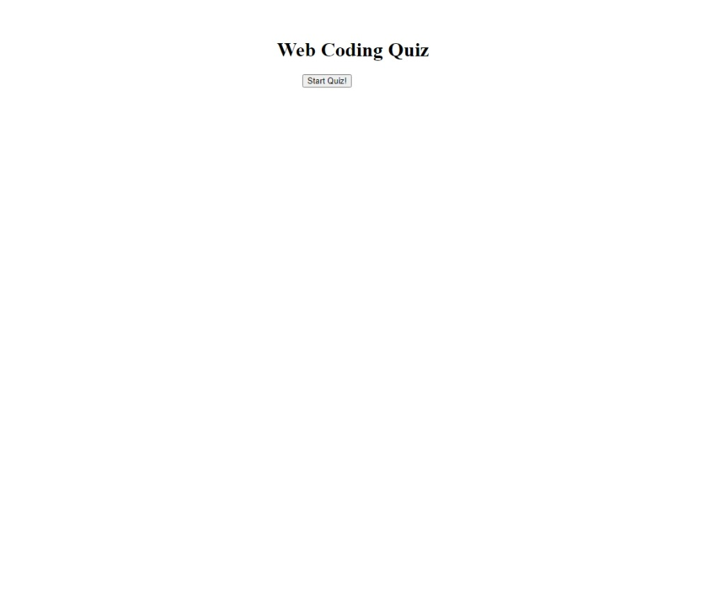
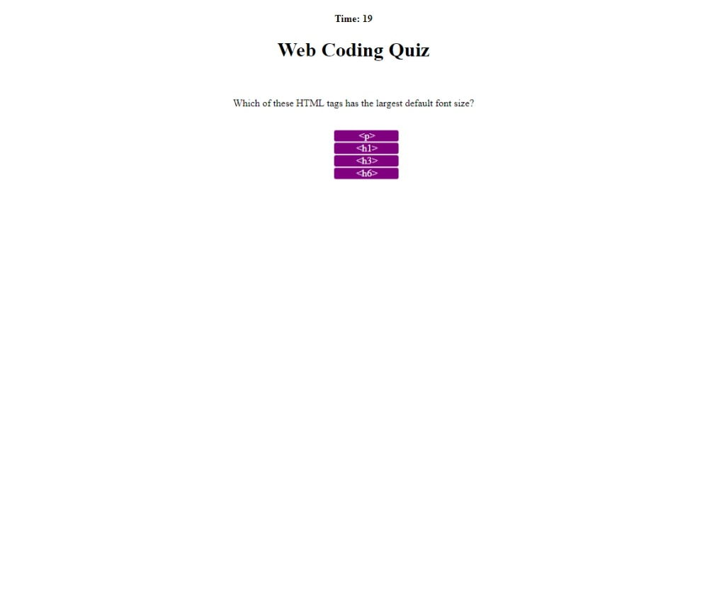
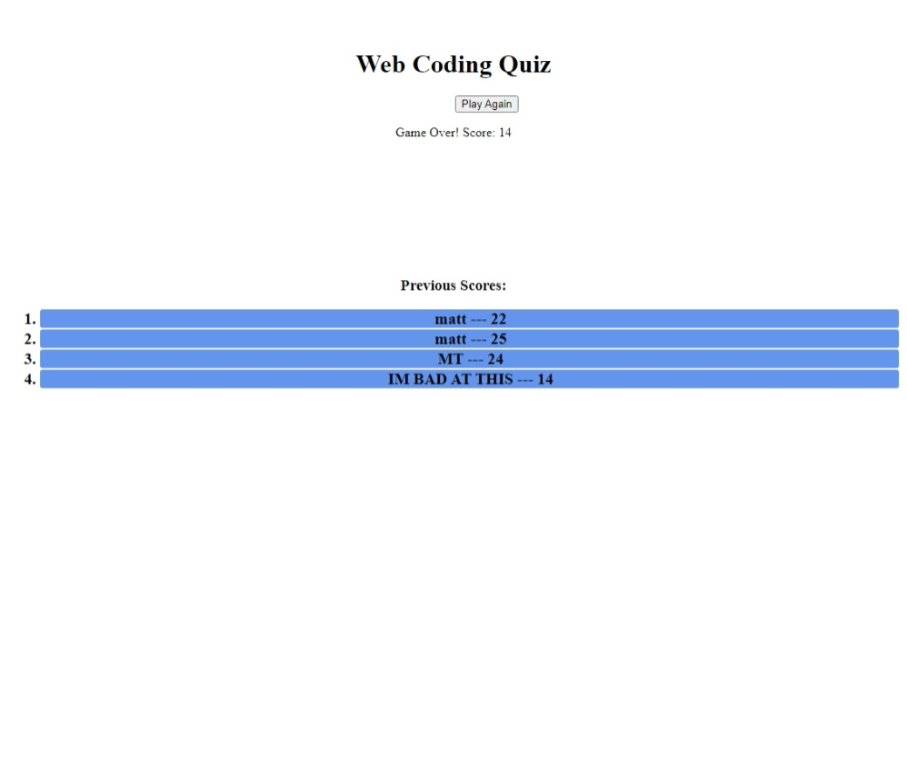

# week4-challenge

## Description

This is a simple quiz app. It contains 5 basic questions about tags and variables in HTML and JS. There is a 30 second timer at the top which counts down to zero. The timer stops if the player completes the quiz. The quiz will also end prematurely if the timer reaches zero. A ten second penalty is incurred for an incorrect answer.

The Start Game button on the webpage places the text for the first question and starts the timer. The Play Again button at the end of the quiz allows the user to redo the quiz, starting from question 1.

At the end of the quiz, a form requesting the users name is shown. A user can type in their name, initials, or any identifier that they'd like to save the score from their attempt. A table listing the previous scores is displayed once the user has submitted a name. The names and scores are saved locally and are displayed at the end of every subsequent attempt, even if they close and re-open the page.

## Usage

Users are guided through the application by clicking buttons and typing in prompts. At the end, users have the option to restart by clicking another button.

## Visual

## URLs

[This is the GitHub repository for this webpage](https://github.com/Shippo704/week4-challenge)

[This is the deployed webpage](https://shippo704.github.io/week4-challenge/)